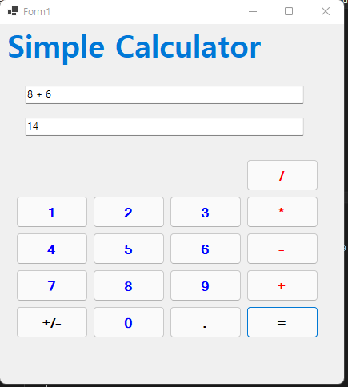
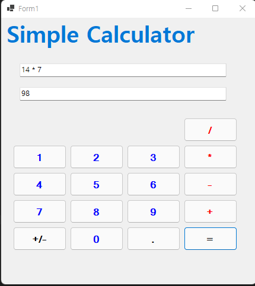
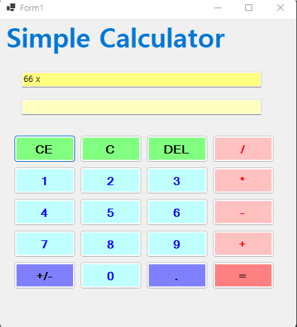
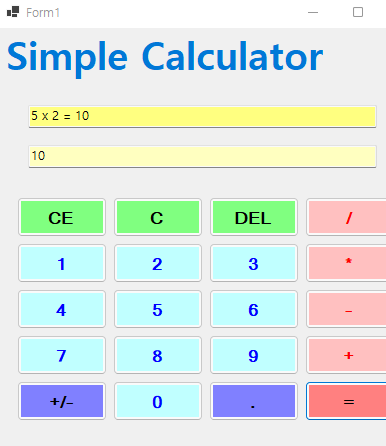

## 개요
- C# 프로그래밍 학습
- 1줄 소개:
	- 사용자의 입력을 통해 숫자를 입력하고, 더하기 연산을 수행하는 간단한 계산기 프로그램
- 사용한 플랫폼:
	- C#, .NET Windows Forms, Visual Studio, GitHub
- 사용한 컨트롤:
	- Label, TextBox, Button
- 사용한 기술과 구현한 기능:
	- Visual Studio의 Windows Forms를 활용하여 계산기 UI를 구성하였습니다.
	- 숫자 버튼 클릭 시 TextBox에 입력값이 누적되도록 이벤트를 처리하였습니다.
	- 연산자 버튼 클릭 시 입력된 값 뒤에 연산 기호가 추가되도록 구현하였습니다.
	- int.Parse()를 사용하여 문자열 데이터를 정수형으로 변환하였습니다.
	- ToString()을 사용하여 계산 결과를 문자열로 변환하여 출력하였습니다.
	- 버튼 클릭 이벤트를 활용한 이벤트 기반 프로그램 구조로 구현하였습니다.

## 실행 화면 (과제1)
- 과제1 코드의 실행 스크린샷

- 과제 내용
	- TextBox와 Button을 이용하여 기본적인 계산기 UI를 구성하였습니다.
	- 숫자 버튼을 클릭하면 입력창에 값이 누적되어 표시되도록 구현하였습니다.
	- 더하기 연산을 수행하기 위한 연산자 버튼과 결과 출력 기능을 구성하였습니다.

- 구현 내용과 기능 설명
    - 숫자 버튼 클릭 시 sender를 이용하여 버튼의 값을 가져오고 TextBox에 누적되도록 구현하였습니다.
    - 연산자 버튼 클릭 시 입력된 숫자 뒤에 연산 기호가 추가되도록 하여 계산식 형태로 표현하였습니다.
    - 입력된 문자열 데이터를 Split()을 통해 분리하고, Trim()을 사용하여 공백을 제거한 후 정수형으로 변환하여 계산을 수행하였습니다.
    - 계산 결과는 ToString()을 사용하여 문자열로 변환 후 출력창에 표시하였습니다.

- 사용한 기술과 구현한 기능:
	- Button Click 이벤트를 활용한 사용자 입력 처리
	- sender를 이용한 공통 이벤트 처리 방식 구현
	- string.Split()을 이용한 문자열 분리
	- Trim()을 이용한 공백 제거
	- int.Parse()를 이용한 형변환 처리
	- ToString()을 이용한 결과 출력

## 실행 화면 (과제2)
- 과제2 코드의 실행 스크린샷

- 과제 내용
	- 기존 더하기 기능에서 확장하여 뺄셈, 곱셈, 나눗셈 기능을 추가하였습니다.
	- 사용자가 입력한 계산식을 기반으로 다양한 사칙연산을 수행할 수 있도록 구현하였습니다.

- 구현 내용과 기능 설명
    - 연산자 버튼(+,-,*,/) 클릭 시 입력창에 해당 연산 기호가 추가되도록 구현하였습니다.
    - 입력된 문자열에서 어떤 연산자가 사용되었는지 Contains()를 통해 판별하였습니다.
    - Split()을 활용하여 연산자를 기준으로 문자열을 분리하고, 각 피연산자를 추출하였습니다.
    - Trim()을 사용하여 공백을 제거한 후 int.Parse()를 통해 정수형으로 변환하였습니다.
    - switch 또는 조건문을 활용하여 연산자에 맞는 계산을 수행하도록 구현하였습니다.
    - 나눗셈의 경우 0으로 나누는 상황을 방지하기 위해 조건문을 추가하여 예외 처리를 하였습니다.

- 사용한 기술과 구현한 기능:
	- Button Click 이벤트를 활용한 연산자 입력 처리
	- string.Contains()를 이용한 연산자 판별
	- string.Split()을 이용한 문자열 분리
	- Trim()을 이용한 입력값 정제
	- int.Parse()를 이용한 형변환 처리
	- 조건문(if, switch)을 활용한 사칙연산 구현
	- 예외 처리를 통한 안정성 향상

## 실행 화면 (과제3)
- 과제3 코드의 실행 스크린샷

- 과제 내용
	- 계산기의 편의성을 높이기 위해 C, CE, Del 기능을 추가하였습니다.
	- 입력된 데이터를 초기화하거나 일부만 삭제할 수 있도록 구현하였습니다.

- 구현 내용과 기능 설명
    - C 버튼 클릭 시 입력창과 결과창의 모든 데이터를 초기화하도록 구현하였습니다.
    - CE 버튼 클릭 시 현재 입력창(txtInput)의 값만 초기화하여 다시 입력할 수 있도록 하였습니다.
    - Del 버튼 클릭 시 입력된 문자열의 마지막 한 글자를 제거하여 부분 수정이 가능하도록 구현하였습니다.
    - 문자열 길이를 확인한 후 Substring()을 사용하여 마지막 문자를 제거하는 방식으로 구현하였습니다.
    - 입력값이 없는 상태에서 Del 버튼을 눌렀을 때 오류가 발생하지 않도록 조건문을 통해 예외 처리를 추가하였습니다.
	- 디자인을 더 꾸몄습니다.

## 실행 화면 (과제4)
- 과제4 코드의 실행 스크린샷

- 과제 내용
	- 사용자 편의성을 높이기 위해 키보드 입력 기능을 추가하였습니다.
	- 마우스를 사용하지 않고도 숫자 입력과 연산이 가능하도록 구현하였습니다.

- 구현 내용과 기능 설명
    - KeyDown 이벤트를 활용하여 키보드 입력을 감지하고, 숫자 키 입력 시 TextBox에 값이 입력되도록 구현하였습니다.
    - Enter 키 입력 시 결과 버튼(=)이 실행되도록 하여 빠르게 계산할 수 있도록 하였습니다.
    - 연산자 키(+, -, *, /) 입력 시 버튼 클릭과 동일하게 입력창에 반영되도록 구현하였습니다.
    - 키보드 입력과 버튼 입력이 동일한 방식으로 동작하도록 이벤트를 통합하여 처리하였습니다.
    - 잘못된 키 입력에 대한 예외 상황을 고려하여 입력 가능한 키를 제한하는 방식으로 안정성을 높였습니다.

- 사용한 기술과 구현한 기능:
	- KeyDown 이벤트를 이용한 키보드 입력 처리
	- e.KeyCode를 활용한 키 값 판별
	- PerformClick()을 이용한 버튼 이벤트 재사용
	- 조건문(if)을 이용한 입력 제어
	- 이벤트 기반 프로그래밍을 통한 사용자 편의 기능 구현

- 사용한 기술과 구현한 기능:
	- Button Click 이벤트를 활용한 기능 제어
	- TextBox의 Text 속성을 이용한 데이터 초기화
	- Substring()을 이용한 문자열 일부 제거
	- Length 속성을 이용한 문자열 길이 확인
	- 조건문(if)을 활용한 예외 처리
